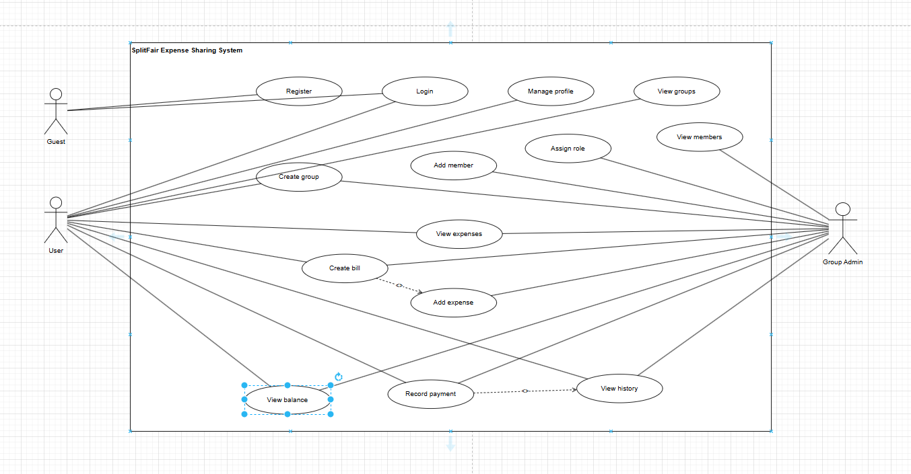

# 💰 SplitFair – Expense Sharing System

## 📌 Overview
SplitFair is an expense sharing system that helps users manage group expenses, track shared costs, and calculate balances between members.

This project focuses on **Business Analysis** and system design based on real-world scenarios.

---

## 🎯 Objectives
- Manage group expenses efficiently  
- Track shared payments among members  
- Calculate debts and settlements  
- Design clear system workflows and data structure  

---

## 🧠 Business Analysis Artifacts

### 🗄️ ERD (Entity Relationship Diagram)

---

### 📊 Use Case Diagram

---

## 👥 Actors
- Guest  
- User  
- Group Admin  

---

## 🚀 Main Features

### 🔐 Authentication
- Register account  
- Login  

### 👥 Group Management
- Create group  
- Add members  
- Assign roles  
- View members  

### 💰 Expense Management
- Create bill  
- Add expense  
- View expenses  

### 📊 Settlement
- View balance  
- Record payment  
- View history  

---

## 🛠️ Tech Stack
- Java Spring Boot  
- MySQL  
- RESTful API  
- Git & GitHub  

---

## 🔗 Repository
https://github.com/VoMinhDuc1311/SplitFairBE

---

## 👨‍💻 Author
Vo Minh Duc  
Business Analyst Intern / Backend Developer
